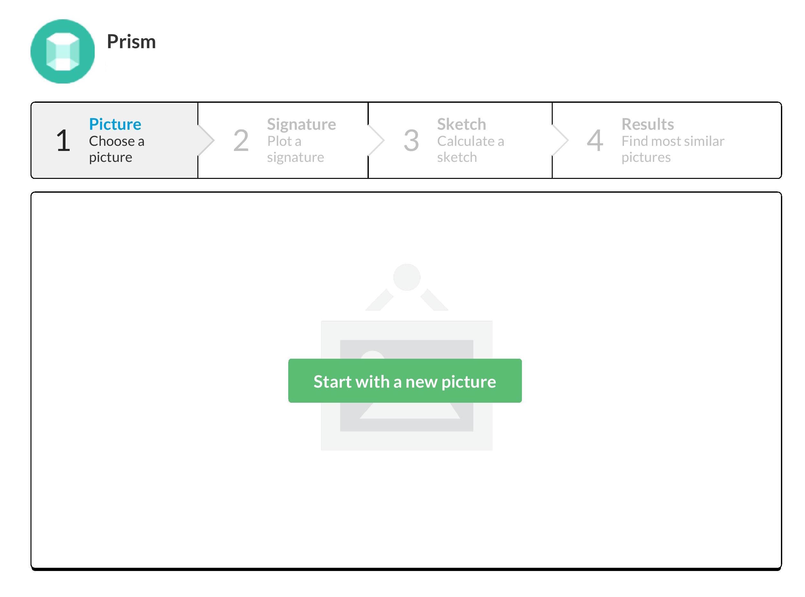
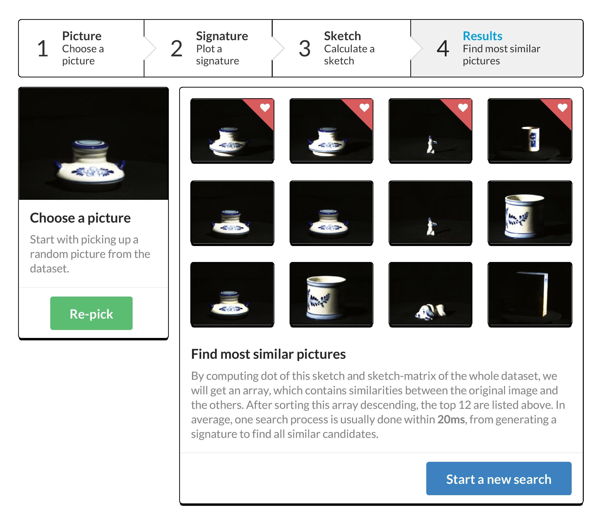
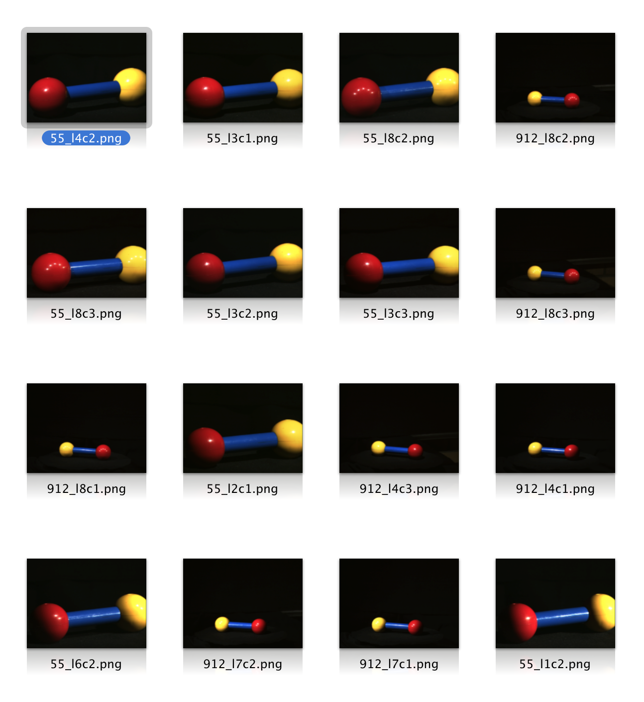
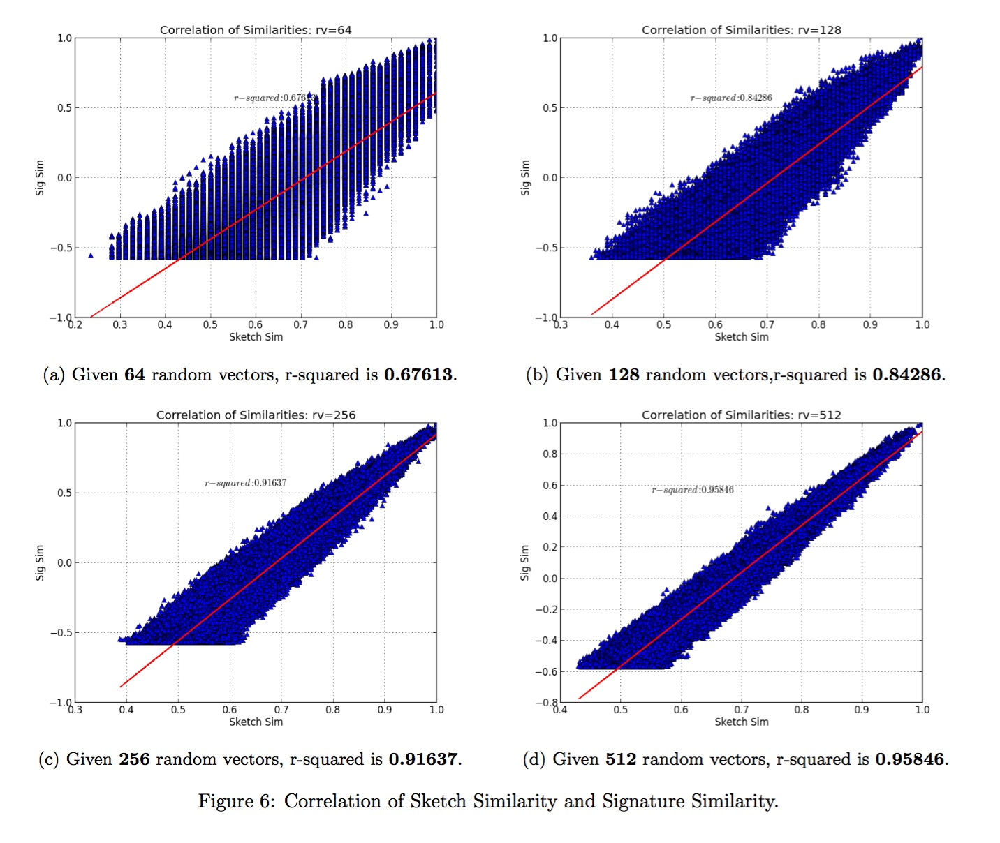
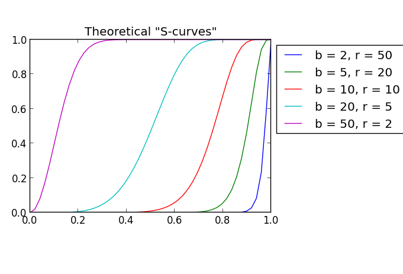

# Prism

An image quick clustering tool based on colour spectrum.

Prism starts with the color spectrum of images to generate *signatures*, abstract compact *minhash sketches*, and apply with *LSH*(locality-sensitive hashing) to find inner clusters.

## Introduction

### Plot a signature

To find similar images, one basic idea is to start with the similar colour histograms they share, and thus the number of pixels in similar colours should be close.

Here we hash all pixels into 64 bins, according to corresponding area of their colors. These 64 integers form a signature, which is able to describe the colour information of original picture.

### Calculate a sketch

With the 64-int signature *x*, we pick 128 random vectors *v* and apply them to signature by computing *v1.x*,*v2.x* until *v128.x* and then replace any positive value by 1 and any negative value by 0, to get a 128-bit (16-byte) *sketch*. The sketch contains information to find similar pictures, but only consumes **1/1500** storage of the original file.

### Find most similar pictures

By computing dot of this sketch and sketch-matrix of the whole dataset, we will get an array, which contains similarities between the original image and the others. After sorting this array descending, the top 12 are listed above. In average, one search process is usually done within **20ms**, from generating a signature to find all similar images.

### Tuning parameters

To be optimized:

* Bin size to hold digits of colours: 2, 4, 8, 16 or bigger? The *bin_size* function is used to optimize this parameter.

* Vectors to be randomly generated: calculation of more vectors leads to higher accuracy but also consumes more time and memory. 64, 128, 256 or bigger? 

*R-squared* is a statistical measure of how close the data are to the fitted regression line. Selecting *256* vectors ensures a r-squared greater than `0.9`.

## Methodology

This project is based on Python. Recommend [another article](https://cran.r-project.org/web/packages/textreuse/vignettes/textreuse-minhash.html) explaining this solution of *minhash* and *LSH* in R.

LSH S-curves.

## Dataset

[*ALOI*](http://aloi.science.uva.nl/) is a color image collection of one-thousand small objects, recorded for scientific purposes. In order to capture the sensory variation in object recordings, we systematically varied viewing angle, illumination angle, and illumination color for each object, and additionally captured wide-baseline stereo images. We recorded over a hundred images of each object, yielding a total of 110,250 images for the collection.

Illumination direction is varied in 24 configurations and for each object there are 24 pictures. 
